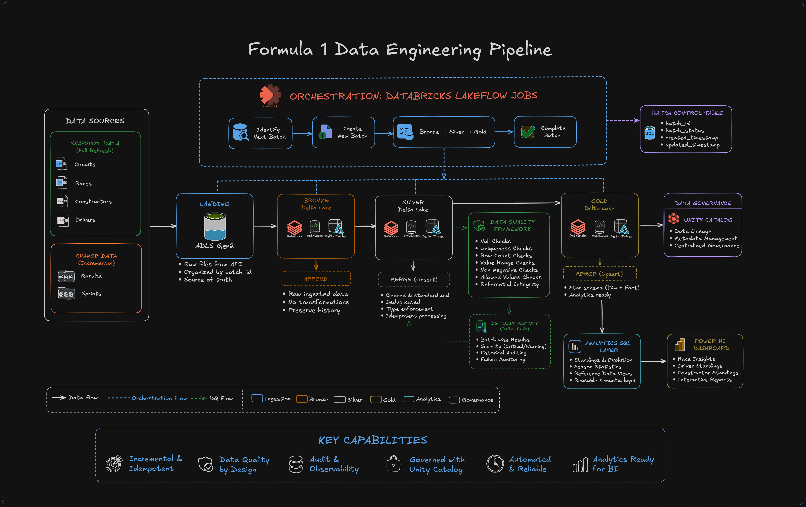
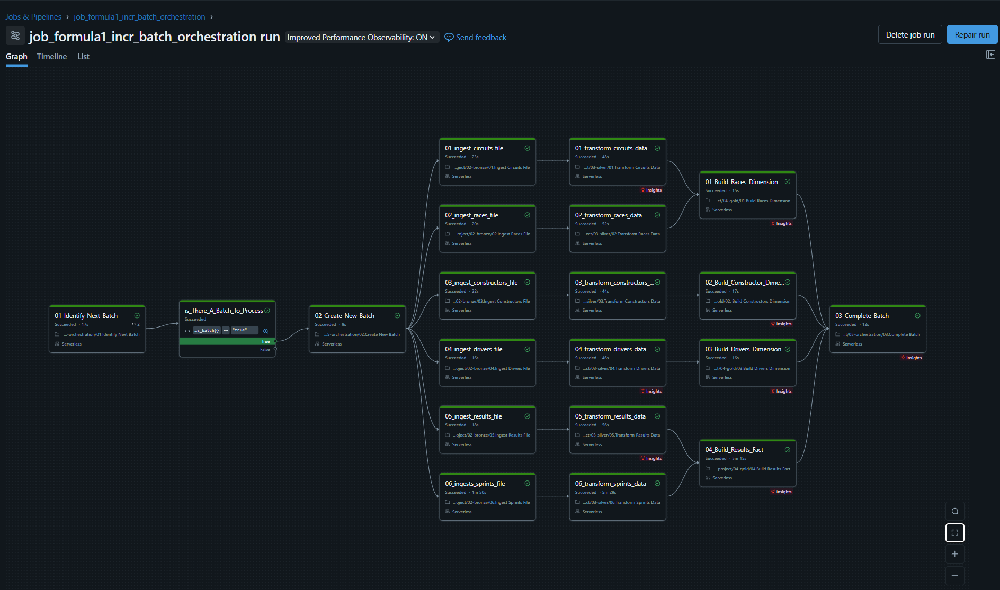
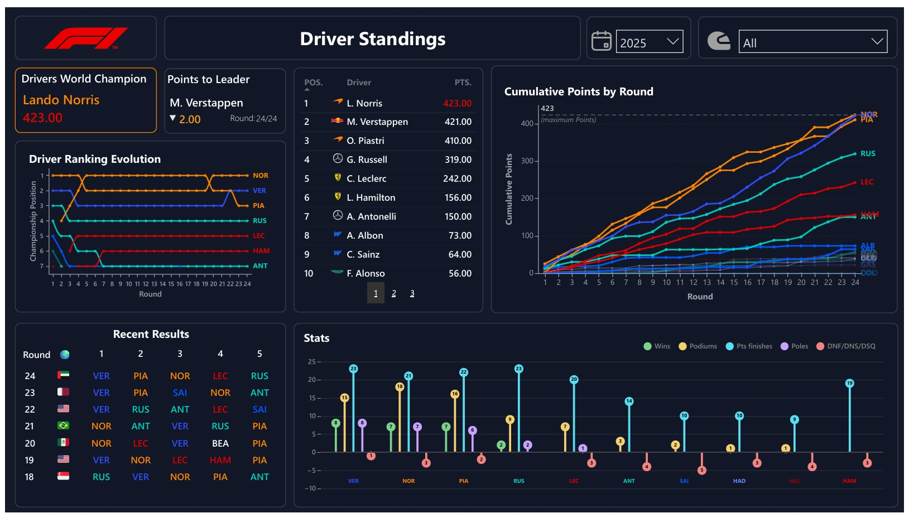
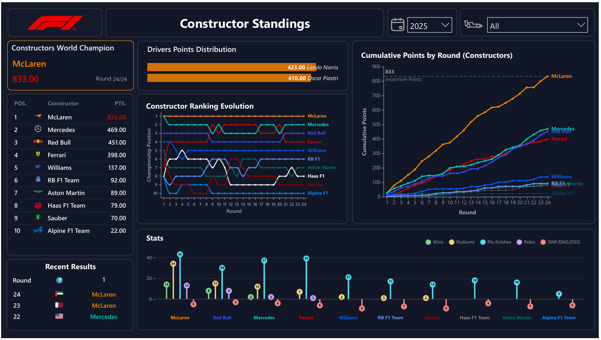

<div align="center">

# 🏎️ Formula 1 Data Engineering Pipeline

**An end-to-end, production-grade data pipeline built on Azure Databricks and ADLS Gen2, following a Medallion architecture (Bronze → Silver → Gold), serving a Power BI dashboard tracking F1 seasons from 2020.**

[](https://azure.microsoft.com/en-us/products/databricks/)
[](https://delta.io/)
[](https://spark.apache.org/)
[](https://powerbi.microsoft.com/)
[](https://docs.databricks.com/data-governance/unity-catalog/index.html)

</div>

---

## ⚡ TL;DR

Built a fully automated, incremental batch pipeline that ingests raw F1 race data from the Jolpica F1 API, processes it through three Delta Lake layers (Bronze → Silver → Gold), enforces data quality at every stage, and surfaces insights via a multi-page Power BI dashboard — all orchestrated on a weekly schedule via Databricks Lakeflow Jobs with alerting on failure and duration warnings.

---

## 📌 About the Project

Formula 1 race data is sourced from the Jolpica F1 API and processed as incremental race-weekend batches through a Medallion architecture designed to mirror production data engineering practices.

- **Incremental by design** — each race weekend is an isolated batch. Already-processed rounds are never reprocessed, making the pipeline idempotent and cost-efficient.
- **Medallion architecture** — raw data is preserved in Bronze, cleaned and standardised in Silver, and modelled into an analytics-ready star schema in Gold.
- **Data quality as a first-class concern** — 7 check types (null, uniqueness, row count, value range, non-negative, allowed values, referential integrity) run on every Silver table per batch. Results are persisted to an audit table and critical failures halt the pipeline.
- **Operational maturity** — automated weekly scheduling, email alerts on start/success/failure/duration, and a batch control table that tracks every run end-to-end.

### 📡 Data Source

The pipeline ingests Formula 1 race data from the Jolpica F1 API (https://api.jolpi.ca), a community-maintained continuation of the Ergast API. Source data is extracted as JSON payloads, landed into ADLS Gen2, and processed incrementally through a Medallion architecture using batch-oriented ingestion patterns.

### Architecture



---

## 🛠️ Tech Stack

| Layer | Technology | Purpose |
|---|---|---|
| **Cloud Storage** | Azure Data Lake Storage Gen2 | Landing zone + Delta table storage |
| **Compute** | Azure Databricks (PySpark) | All transformation and processing |
| **Table Format** | Delta Lake | ACID transactions, time travel, upsert (MERGE) |
| **Catalog & Governance** | Unity Catalog (`formula1_incr`) | Governance, metadata, lineage |
| **Orchestration** | Databricks Lakeflow Jobs | DAG-based pipeline scheduling + alerting |
| **Transformation** | PySpark + Databricks Notebooks | Bronze ingestion, Silver cleaning, Gold modelling |
| **Data Quality** | Custom DQ Framework (PySpark) | 7 check types, audit table, critical-failure halting |
| **Analytics Layer** | Spark SQL Views | Standings, evolution, stats, reference data |
| **BI & Reporting** | Power BI Desktop + Deneb | Dashboard with native and custom Deneb visuals |


---

## 📁 Project Structure

```
📦 formula1-data-engineering-project
 ┣ 📁 formula1-project/
 ┃ ┣ 📁 00-common/               # Shared helpers: environment config, bronze/silver/gold/DQ helpers
 ┃ ┣ 📁 01-setup/                # One-time setup: catalog, schemas, volumes, reference tables
 ┃ ┣ 📁 02-bronze/               # Ingestion notebooks: circuits, races, constructors, drivers, results, sprints
 ┃ ┣ 📁 03-silver/               # Transformation notebooks: type enforcement, deduplication, upsert
 ┃ ┣ 📁 04-gold/                 # Dimensional model: dim_races, dim_constructors, dim_drivers, fact_session_results
 ┃ ┣ 📁 05-orchestration/        # Batch control: identify → create → complete batch
 ┃ ┣ 📁 07-lakeflow-jobs/        # Databricks job YAML (DAG definition + weekly schedule)
 ┃ ┣ 📁 08-analytics/            # SQL views: standings, evolution, stats, reference
 ┃ ┗ 📁 09-Reporting-BI/         # Native Visuals and Deneb JSON specs for Power BI custom visuals
 ┣ 📁 ref_images/
 ┃ ┣ 📁 constructors-png/        # Constructor logos (dark + transparent, 16px)
 ┃ ┣ 📁 country-flags-png/       # Country flag images (32 / 64 / 128px)
 ┃ ┗ 📁 helpers-svg/             # Custom SVG icons (F1 logo, calendar, helmet, race car)
 ┗ 📄 README.md
```

---

## 🗄️ Medallion Architecture & Data Model

The pipeline follows a three-layer Medallion architecture. Each layer has a clear contract — Bronze preserves the source, Silver standardises it, Gold serves it.

---

### 🟠 Bronze — Raw Ingestion

CSV files land in ADLS Gen2 under a `batch_id`-keyed path. Bronze notebooks read each file, append pipeline metadata (`ingestion_timestamp`, `source_file`, `batch_id`), and write to Delta tables with no transformations applied. Source data fidelity is preserved entirely — this layer is the source of truth for reprocessing.

**Key design decision:** column names remain in their original camelCase from the Jolpica F1 API. Type inference is intentionally deferred to Silver.


---

### 🔵 Silver — Cleaned & Standardised

Silver notebooks apply column renaming (camelCase → snake_case), explicit data type casting, null handling, and deduplication. Writes use Delta `MERGE` on the batch primary key, making each run fully idempotent. Two metadata columns (`ingestion_timestamp`, `source_file`) are carried forward for lineage.

**Key design decision:** incremental upsert rather than full overwrite keeps processing costs proportional to the batch size, not the total table size.


---

### 🟡 Gold — Dimensional Model (Star Schema)

Gold implements a classic star schema. `fact_session_results` unifies race and sprint results under a `session_type` discriminator column, eliminating the need for separate fact tables. Pre-computed boolean flags (`is_win`, `is_podium`, `has_points`, `is_pole`) push aggregation logic out of the BI layer and into the pipeline, keeping analytical views simple and query performance fast.


---

## ⚙️ Orchestration

The pipeline is orchestrated as a **Databricks Lakeflow Job** running on a weekly CRON schedule (every Monday at 07:51 AM IST). The job is defined as a version-controlled YAML file under `07-lakeflow-jobs/`.

### Job DAG

The DAG enforces a strict dependency order:

1. **`01_Identify_Next_Batch`** — queries the batch control table to find the next unprocessed batch. If none exists, a conditional branch (`is_There_A_Batch_To_Process`) short-circuits the run cleanly rather than failing.
2. **`02_Create_New_Batch`** — registers the batch as in-progress in the control table, establishing a single audit record for the run.
3. **Bronze + Silver tasks (parallel)** — 6 Bronze ingestion tasks fan out in parallel, each feeding its corresponding Silver transformation task. This parallelism cuts wall-clock time significantly vs sequential execution.
4. **Gold dimension + fact tasks** — The Gold layer is built from Silver data, producing dimension and fact tables for analytical consumption.
5. **`03_Complete_Batch`** — marks the batch as successfully processed in the control table. Only reached if all upstream tasks succeed.



**Alerting:** Email notifications fire on job start, success, failure, and duration warning — mimicking production SLA monitoring patterns.

---

## ✅ Data Quality

A custom DQ framework runs on every Silver table after each transformation. Results are persisted to a dedicated Delta audit table (`formula1_incr.silver.data_quality_results`), creating a queryable history of every check across every batch.

### Check Types

| Check | What It Validates |
|---|---|
| `not_null` | Primary key and required columns contain no nulls |
| `unique` | Composite PK columns produce no duplicate rows |
| `min_rows` | Batch has a minimum expected row count (catches empty/truncated files) |
| `value_range` | Numeric columns (e.g. `points`, `grid_position`) fall within expected bounds |
| `not_negative` | Columns that must be ≥ 0 (e.g. `completed_laps`, `points`) |
| `allowed_values` | Categorical columns (e.g. `session_type`) contain only valid values |
| `referential` | Foreign keys resolve against their parent dimension table |

### Severity Model

- **`critical`** — pipeline halts immediately and raises an exception. The batch is not marked complete. Example: null values in a PK column.
- **`warning`** — logged and flagged in the audit table but does not halt execution. Example: unexpectedly low row count in a sprint round (some rounds have no sprint).

### Delta CHECK Constraints

In addition to runtime DQ checks, Delta-level `CHECK` constraints are applied to Silver tables at setup time, enforcing invariants at the storage layer — a second line of defence independent of the pipeline code.

---

## 📊 Analytics & BI Dashboard

Gold layer data is surfaced via Spark SQL views (`08-analytics/`) and consumed directly by Power BI. Custom visuals are built using **Deneb** (Vega-Lite) for the ranking evolution charts and lollipop stat charts.

### Driver Standings



### Constructor Standings



**Dashboard features:**

| Feature | Description |
|---|---|
| World Champion card | Highlights current leader with total points |
| Points to Leader | Live gap between P1 and P2 |
| Ranking Evolution | Championship position line chart across all seasonal rounds |
| Cumulative Points | Season-long points accumulation per driver / constructor |
| Recent Results | Last 7 rounds with top-5 finishers per race |
| Stats Chart | Per-entity breakdown: Wins, Podiums, Points Finishes, Poles, DNF/DNS/DSQ |
| Year slicer | Filter all visuals by season (2020 to current year) |
| Driver / Constructor slicer | Isolate a specific entity across all visuals |

---

## 📜 License

This project is for personal and educational use. Formula 1 data is sourced from the Jolpica F1 API (https://api.jolpi.ca), an open-source community-maintained continuation of the Ergast API. For project details and documentation, see https://github.com/jolpica/jolpica-f1.

F1 branding and trademarks belong to Formula One World Championship Limited.